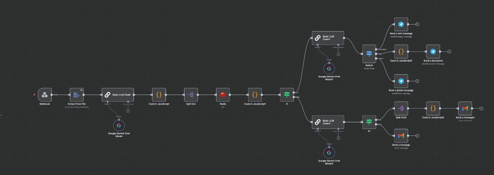
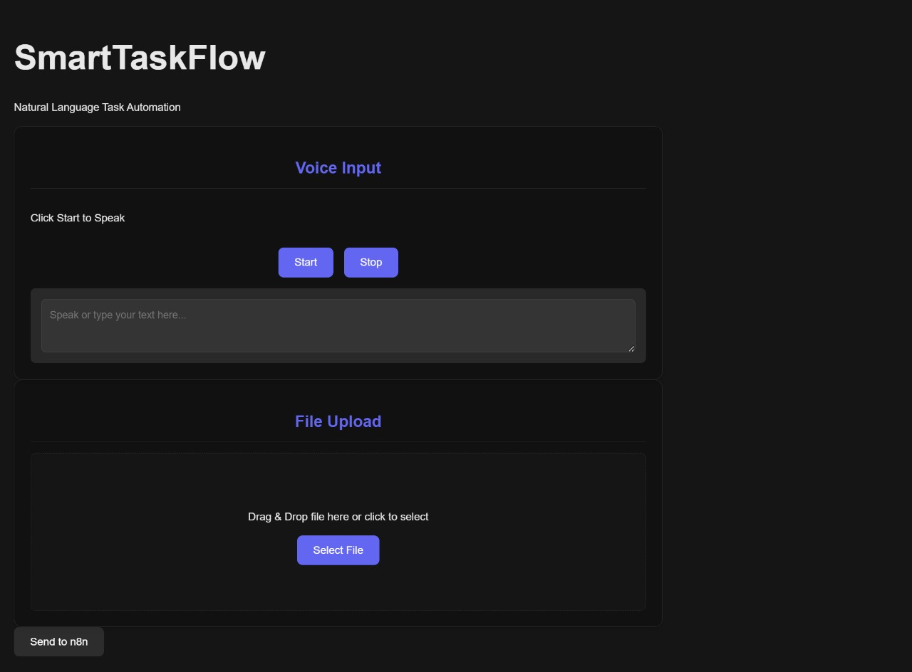

# 🧠 SmartTaskFlow-n8n  
**Automating task parsing and multi-channel communication using n8n + React**

---

## 🚀 Overview  
**SmartTaskFlow** is an intelligent automation system that connects a **React-based front end** with **n8n workflows** to process user tasks.  
It interprets user inputs like reminders or file-sharing tasks and executes them automatically — sending messages, emails, or attachments.

### ✨ Example  
> “Remind Ria to submit the report via Gmail.”  
→ SmartTaskFlow parses the task, identifies the recipient and action, and triggers the n8n workflow to send the mail instantly.

---

## 🧩 Tech Stack  

| Component | Technology |
|------------|-------------|
| Frontend | React (Vite) |
| Automation | n8n |
| Backend Bridge | Webhooks + Fetch API |
| Language Parsing | LLM (via n8n Code Node) |
| Styling | Poppins Font + Custom CSS |
| Hosting | ngrok (for local tunneling) |
| Optional | Upstash / Redis for caching |

---

## 🏗️ Architecture  

**Flow:**  
`User (Voice/Text Input)` → `React Frontend (VoiceInput.jsx / FileUpload.jsx)` →  
`n8n Webhook (POST via Fetch)` → `LLM Task Parser` →  
`JSON Task Array` → `Conditional Routing` →  
`Gmail Node (for emails)` / `Telegram Node (for messages)`  

---

## ⚙️ Features  

- 🎙️ Voice or text command input  
- 📂 File upload with automatic routing  
- 🤖 LLM-based task extraction  
- 📤 Smart multi-channel sending (Gmail, Telegram)  
- 🔁 Dynamic looping for multiple recipients/files  

---

🚀 How to Use / Run This Project
🧩 1. Clone the Repository
git clone https://github.com/vaishaliragi66-rgb/agentic-ai-training-66.git
cd agentic-ai-training-66

⚙️ 2. Set Up the Frontend

Navigate to your React app folder:

cd frontend

Install dependencies:

npm install

Run the development server:

npm run dev

The app will run at http://localhost:5173/

🧠 3. Set Up n8n Automation

Make sure Docker or n8n Desktop is running.

Open your n8n workspace and import this workflow:
📥 Download SmartTaskFlow Workflow JSON

Make sure the following nodes are configured:

✅ Webhook Trigger → in production mode

✅ Gmail Node (with your credentials)

✅ Telegram Node (Bot API connected)

🌐 4. Connect Frontend ↔ n8n

Copy your ngrok public URL, e.g.:

https://random-id.ngrok-free.app

In your React code, update all fetch URLs:

const webhookUrl = "https://random-id.ngrok-free.app/webhook";

Test sending a text or file — it should reach n8n instantly.

🧱 5. Optional Setup (For Stability)
Feature	Tool	Purpose
Caching	Upstash / Redis	Store request states
Hosting	Vercel / Netlify	Deploy frontend
Tunneling	ngrok	Expose local n8n server
Version Control	Git + GitHub	Collaboration and commits

🖼️ 6. Visual References
Workflow Architecture:

Frontend UI:

Demo:
 [Watch Task4U Demo](Task4U-demo.mp4)

🧾 License
MIT License © 2025 SmartTaskFlow
